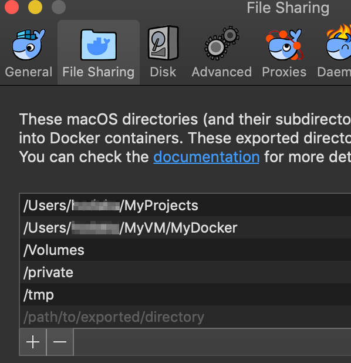

# :dolphin:Rejangras:flags: = React + Django + Postgres

This comprehensive guide showcases the seamless integration of React, Django, and Postgres within a Docker environment, so that it is easier for moving whole App to cloud server, like AWS EC2 + RDS combo.

## Technologies Employed

* React ⚛️
* Node.js ️
* Axios  (for making HTTP requests)
* Bulma ⚡ (for a clean and responsive UI)
* Python 
* Django  (for building a robust backend)
* Django REST framework  (for building an efficient API)
* Postgres  (for reliable database management)
* Docker  (for containerization goodness)
* Docker Compose ️ (for orchestrating your containers)

## Prerequisites

To embark on this journey, you'll need the following prerequisites:

* Docker (download link: https://www.docker.com/)
* Docker Compose (download link: https://docs.docker.com/compose/install/)
Or, for *nix
```
sudo apt install docker-compose
```

## Getting Started

To see the app, clone the repo and execute `docker-compose up`.

```
git clone git@github.com:0yj/rejangras.git
cd rejangras
sudo docker-compose up
```

Three Docker containers will be launched after last step: 
```
sudo docker ps
```
### django_db

The django_db is the Postgres database.

### django_rest_api

The django_rest_api is the Python/Django Web API. This returns JSON data when accessing `localhost:8000`.

### django_web_front

The django_web_front is the Node.js/React container. This fetches API data from django_rest_api using React.

After launching those containers, access the `localhost:3000`. The App will be shown the below.


## File Sharing settings

It is necessary to modify the file sharing settings, since the directory of the host will be mounted as VOLUME, depending on the directory location.



## Details about files

The app directory and files configuration the below.

```
.
├── DockerfileNode
├── DockerfilePostgres
├── DockerfilePython
├── code
│   ├── django_db
│   │   └── init-user-db.sh
│   ├── django_rest_api
│   │   ├── requirements.txt
│   │   ├── run-migrate-and-server.sh
│   │   └── test_app
│   └── django_web_front
│       ├── npm-install-and-start.sh
...     ...
└── docker-compose.yml
```

### docker-compose.yml

The configuration of the app is managed by docker-compose.yml.

### DockerfileXXXX

There are three Dockerfiles the below.

- DockerfileNode
- DockerfilePostgres
- DockerfilePython

These files are specified in docker-compose.yml and used when building each Docker images.

### code/

There are application codes in this directory.

### Entry points

There are three entry points the below.

- init-user-db.sh
- run-migrate-and-server.sh
- npm-install-and-start.sh

The app is specified some entry points in the `docker-compose.yml`. The command is executed when each container starts.

Go inside DB:
```bash
sudo docker exec -it containerID bash
psql -U postgres -b test_app
```
Combo with Jetbrain Datagrip
```bash
sudo docker inspect -f '{{range .NetworkSettings.Networks}}{{.IPAddress}}{{end}}' django_db
```
Use this ip as host and port is 5432
Set username and password then you will be fine! 
## Author

[YJ](https://github.com/0YJ)
